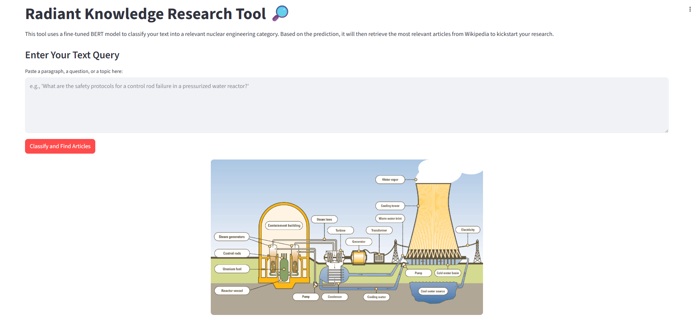

# README-Natural Language Processing- "Radiant Knowledge Research"

## Brian Benedicks

<!-- Add your content below -->

### Ethics Statement

This application prioritizes educational development. The purpose of this application is to aid in knowledge and research development. No private information is collected for the purposes of this application. 

### Objective- To employ text classification to aid those interested in the nuclear sphere to be able to prompt a phrase,word or question to further expand the scope of knowledge in this burgeoning field.

### 1. Data Sources

- A script was used to collect articles from wikipedia with subject classes pertaining to nuclear power. For example, a topic that were germane to reactor physics were put in the "reactor physics" class.
- https://drive.google.com/drive/folders/1yvTbvAdoxz3IvIUiOWy177uqx6_b1NxC?usp=drive_link

### 2. Data/Feature Engineering 

1. The BERT tokenizer was used feed into the Bert model. 
2. TF-IDF was used to convert text to vectors for use in the multinomial NB modeling approach.

### 3. Modeling Approach
1. A dummyclassifier was employed to establish a mean baseline by predicting the most frequent class.
2. The TF-IDF was paired with mulinomial NB to determine if word frequency improved accuracy in predicting categories.
3. I built a simple RNN using pytorch.
4. I next employed a LSTM to further gauge how input, forget and update gates would improve upon sequential data.
5. Lastly, I wanted to see how the transformer architecture would perform against its predecessors.

### 4. Model Evaluation- Accuracy was chosen as the evalution metric for this classification problem as the most interpretable means to compare various traditional and deep architectures.
1. The accuracy improved in the order laid out above. NB, since it assumes feature independence and lacks the ability to glean semantic meaning, was surprisingly more accurate than expected. As we moved towards more complicated architectures, I found that the LSTM's were not as accurate as NB-this is perhaps attributed to the fact it was a classification problem-not really a challenge of sequence or time dependencies. BERT was an interesting one. I simply finetuned the BERT model from Hugging face and experimented with different epoch iterations. I found that anymore than 10, we saw a preciptice drop in accuracy.

### Model Comparison:
1. Baseline Accuracy: 0.2876
2. Naive Bayes Accuracy: 0.4706
3. Simple RNN Accuracy: 0.2876
4. Bi-LSTM (from scratch) Accuracy: 0.3333
5. Bi-LSTM w/Word2Vec Accuracy: 0.3137
6. BERT (fine-tuned) Accuracy: 0.5229
   
3. From the above, it is readily apparent that a deep NN's that leverage the transformer architecture far outperformed their earlier counterparts. The ability for the self attention mechanisms to capture semantic meaning via parallel processing completely obviates the need for RNNs, LSTMs and GRUs. LSTMs, RNNs underpeformed due to being trained on relatively small datasets.

### Dependencies- The project employed the following dependencies:
streamlit>=1.28.0
numpy>=1.24.0
torch>=2.0.0
torchvision>=0.15.0
torch>=2.0.0
transformers>=4.21.0
scikit-learn>=1.3.0
pandas>=1.5.0
numpy>=1.24.0
PyPDF2>=3.0.0
gensim>=4.3.0
matplotlib>=3.6.0
seaborn>=0.12.0

### Application:

### To run:
1. Place all files in the same directory and run the script

### Lessons Learned:
1. Establishing the proper RAM and CPU when deploying to the cloud.
2. The compute needed for RNNs, LSTMs and GRUs; the hidden states that save information necessitate a greater amount of memory-I had to wipe the GPU cache during each epoch to make enough memory to complete training the model.

